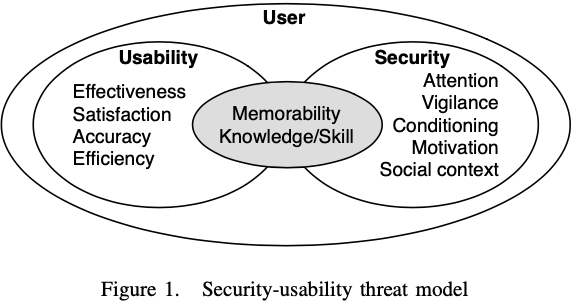

# 1 Introduction

This report analyses the security and usability trade-offs of ChatGPT, an AI assistant created by the AI and research company, OpenAI on November 30th of 2022. This system will be evaluated using the security-usability threat modeling approach as proposed by the Kainda [@kainda2010], as seen in Appendix 1. This is a suitable framework, as it helps to identify the frictions between both the security and usability for legitimate users by considering appropriate usage scenarios, as opposed to the potential threat scenarios that could also arise due to probable user mistakes.

To fully grasp an entire understanding of ChatGPT's security and stability, this report will present three usage scenarios, along with three corresponding threat scenarios based on likely user mistakes, demonstrating particular deficiencies about the system. The scenarios will be thoroughly analysed to determine how easy the system is from a usability perspective. Finally, to top it all off, some recommendations will be given on which the system could improve upon.

The examination of ChatGPT's controversial AI interface will give rise to insight on how it ultimately impact end-user behavior. From this, we can potentially glean strategies to improve this system with the goal of minimizing risk from threats. Overall, the main objective is to evaluate this particular system, ChatGPT, through well defined scenarios in order to provide a more holistic view on the benefits it offers, as well as the understood risk associated.

# 2 Identifying usage scenarios

The definition of usage scenarios, via the Kainda security and usability framework, is as follows.

Usage scenario
: Actions that are desirable to stakeholders of a secure system [@kainda2010].

A more cohesive, in-depth take on this considers a variety of other elements that comprise a usage scenario, explored in two studies [@dong2018; @ortiz2010], but can be summarised in combination as:
$$Scenario=(Time,\space Context,\space User,\space Product,\space Behavior\space (or\space Interaction\space or\space Artefact))$$

It is important to note, that the major elements that comprise a scenario can be broken down further into its relevant subelements.

# 3 Identifying threat scenarios

The definition of threat scenarios, via the Kainda security and usability framework, is as follows.

Threat scenario
: Actions that are not desirable and hence the system should not allow them to happen [@kainda2010].

# 4 Recommendations

# 5 Appendices

## 5.1 Appendix 1

### Kainda’s HCISec security threat model (Security-usability threat model)

