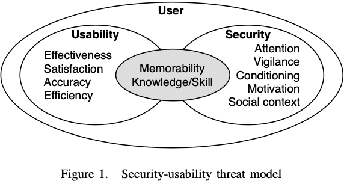
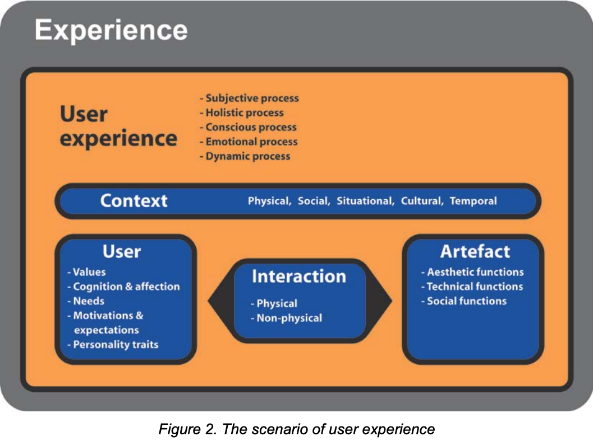
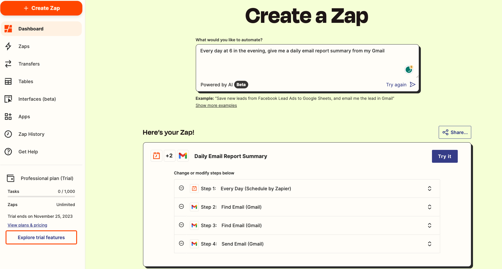

# 1 Introduction

This report analyses the security and usability trade-offs of ChatGPT, an AI assistant created by the AI and research company, OpenAI on November 30th of 2022. This system will be evaluated using the security-usability threat modeling approach as proposed by the Kainda [@kainda2010], as seen in Appendix 1. This is a suitable framework, as it helps to identify the frictions between both the security and usability for legitimate users by considering appropriate usage scenarios, as opposed to the potential threat scenarios that could also arise due to probable user mistakes.

To fully grasp an entire understanding of ChatGPT's security and stability, this report will present three usage scenarios, along with three corresponding threat scenarios based on likely user mistakes, demonstrating particular deficiencies about the system. The scenarios will be thoroughly analysed to determine how easy the system is from a usability perspective. Finally, to top it all off, some recommendations will be given on which the system could improve upon.

The examination of ChatGPT's controversial AI interface will give rise to insight on how it ultimately impact end-user behavior. From this, we can potentially glean strategies to improve this system with the goal of minimising risk from threats. Overall, the main objective is to evaluate this particular system, ChatGPT, through well defined scenarios in order to provide a more holistic view on the benefits it offers, as well as the understood risk associated.

Note, that the platform that has been decided to be analysed for the system, ChatGPT, is iOS, since the web variant has limited features. Although it is the same product and engine, the mobile counterpart is slightly more popular (see Appendix 2) than the web version.

# 2 Analysing scenarios

## 2.1 Defining a scenario

A more cohesive, in-depth take on what a scenario means onsiders a variety of other elements (see Appendix 3) that comprise a scenario, explored in two studies [@dong2018; @ortiz2010], but can be summarised in combination as:
$$Scenario=(Time,\space Context,\space User,\space Product,\space Behavior\space (or\space Interaction),\space Artefact)$$

In which $Time$ defines the duration for which the user interacts with the product [@dong2018]. $Context$ refers to the environmental factors into distinct categories of physical, social, situational, cultural and temporal [@ortiz2010]. $User$ is as it says, however with additional attention to their values, personal traits and ambitions [@ortiz2010]. $Product$ is defined as the actual object that is being considered within the scenario [@dong2018]. $Behavior$ (or $Interaction$) concerns itself with the actual ongoings of the scenario interaction itself, and this could include the type of interaction (physical or non-physical) [@ortiz2010]. Finally, $Artefact$ is the end output of the scenario, which can take the form of either social, technical or aesthetic functions [@ortiz2010].

## 2.2 Usage scenarios

### 2.2.1 Defining usage scenarios

The definition of usage scenarios, via the Kainda security and usability framework, is as follows:

Usage scenario
: Actions that are desirable to stakeholders of a secure system [@kainda2010].

So, with that in mind, here are three key usage scenarios identified for the system under evaluation, ChatGPT.

### 2.2.2 Usage scenarios for ChatGPT

All these scenarios will be under the assumption that the user has an authenticated account and has successfully logged in with said account. A consistent, stable internet communication throughout is obviously a understood prerequisite.

#### 2.2.2.1 Asking specific questions (via both text and speech recognition) to receive specific answers

The main functionality of ChatGPT is for the user to be able to input a specific query and thus, receive the relevant output. The nature of the query on iOS can range from text input or speech recognition. The iOS engine itself may do its own local tasks, such as auto-correcting, spell-checking, text suggestions (see Appendix 4). Once a valid input is parsed, i.e. one which does not violate OpenAI's terms and conditions policy, the AI engine utlises the supremely vast dataset its been provided in combination of its pre-training phase to identify patterns and structures in the prompt it has been given [@semrush2022]. After communication and subsequent back-end server processing, a response is sent back to the user's device. It then generates a coherent response, rendering that on the screen in an easy-to-understand visual way. Specifically, for the ChatGPT iOS application, haptic feedback is given to indicate when a response has completely been delivered (see Appendix 4). The screen rendering of the AI-generated response is done slowly – to be suitable for typical human reading speeds (see Appendix 4).

#### 2.2.2.2 Creating multiple chats, searching for particular chats and searching for words/phrases/characters in said chats

ChatGPT's technology is such that it is able to use the previous prompts and AI-generated responses within a singular chat and extract a context from it. A user may decide that they want a completely new context or just a blank screen for clarity and organisational purposes. When the user swipes left, they are able to see an accumulation of pre-existing chats (if any) with AI-generated titles based on the chat's context, to increase the memorability of the chat for the user. If the user desired to search for a specific pattern of words, phrases or characters from from their entire chat history, again, the iOS engine does its simple local tasks via the keyboard and then the app returns all relevant results it can find within a specific time period. If older results are required, the user is prompted to do so. When a search result is clicked, the application interface then directs the user to very beginning of that specific chat. This can be particularly useful, reducing the mental memory load on the user, as they have numerous chats stockpiled after prolonged general usage.

#### 2.2.2.3 Automating digital tasks

A very niche usage scenario, but is very likely to occur for the advanced user. Such scenarios may include smart home automation to automatic email management, but the process for AI automation remains fairly similar; just adaption for the specific service which the user desires. This starts with the user sending in a prompt, such as:
> "Can you provide steps to schedule a daily email report of my Google Analytics data?"

ChatGPT will then outline a well-informed process, including information on how the user can use tools such as Zapier to connect Google Analytics and Gmail to present the scheduled automated report. Following these instructions will lead the user to the Zapier dashboard (see Appendix 5) where they themselves can further fine-tune and customise the automation to their liking. If the user does decide to adopt a more complex workflow automation, the user can then request ChatGPT for directions for which the user can simply follow them. The involvement of ChatGPT helps to abstract what would be a complex task into simple high-level steps. Again, as mentioned in the second usage scenario (see 2.2.2.2), it takes away from the mental load the user has to invest. The automation takes a series of multiple tasks which the user normally has to manually do themselves.

## 2.3 Threat scenarios

### 2.3.1 Defining threat scenarios

The definition of threat scenarios, via the Kainda security and usability framework, is as follows:

Threat scenario
: Actions that are not desirable and hence the system should not allow them to happen [@kainda2010].

So, with that in mind, here are three key threat scenarios identified for the system under evaluation, ChatGPT.

### 2.3.2 Threat scenarios for ChatGPT

Again, as in 2.2.2, we are taking the base assumption that the user is with an authenticated account and is successfully logged into ChatGPT with said account.

#### 2.3.2.1 User provides sensitive personal information without realising privacy risks

The inherent conversational nature of ChatGPT may lead users to inadvertently disclose personal information which they may not be comfortable expressing without understanding the obvious privacy implications that come alone with that. Such personal information could be in various forms, with examples including mental health information, personal details such as location, ethnic origin, sex orientation or religious beliefs. Without much transparency beforehand on how user data is handled, the user is ill informed of the data processing actions occurring and so, the mental model for the user is to assume that OpenAI handles their data in an anonymous and private way – satiating themselves. If the company was susceptible to data breaches in the future, sensitive disclosures could be leaked and accessed by third parties. The user is therefore unaware of long-term risks that such intimate details may have for them as it could be used for training or commercial purposes. Obviously, it comes to the responsibility of the company, where if they had informed the user clearly beforehand on data processing and usage policies, it will instill a sense of caution in the information that the user shares to ChatGPT. In this manner, the user unintentionally exposes private information without much thought given to privacy, as inaccurate assumptions about anonymity is made.

In order to simulate this for research purposes, a safe and suitable modeling approach would be to conduct an empirical study where participants are given "dummy" ChatGPT conversational prompts that encourage the sharing of personal details. The aim of this study would be to track the responses given, such as if users expresses a concern for privacy. Interviews and surveys can also be carried out to gauge the user's emotional perspective when they are in a typical interaction with ChatGPT, so that an appropriate mental model can be crafted which includes information about their motivations or any other external factors. Furthermore, arguably one of the most important indicators of ChatGPT's data procedures is to analyse OpenAI's terms and conditions, its retention policies, and any usage rights which have been granted to the company.

#### 2.3.2.2 User becomes overly dependent on ChatGPT instead of thinking independently

Again, owing to the innate communicative characteristics of ChatGPT combined with its ability to provide human-like recommendations and responses, there is a certain risk associated where potentially the user might excessively depend upon it when it comes to the final stages of decision making of a user's mental model. For example, if the user asks such a prompt:
> "Should I accept this new job offer I have been proposed or stay within my current role?"

Rather than the initial decision making process which the user typically under goes, where they would likely weigh the pros of cons of each outcome, they may depend heavily on the arguments that ChatGPT presents, as complex choices are considered throughout. The user makes an underlying assumption – ChatGPT has better knowledge and rationale than them, and looks at situations from an unbiased perspective. Whilst this may be the case, ChatGPT lacks subjective nuance, emotional intelligence and wisdom when it comes to real life scenarios. Even though it may offer some preliminary advice, it cannot take into account of all factors which are intrinsic to humans and their decision-making processes in their mental models. A prolonged over dependence on AI [@theophilou2023] can eventually corrode a user's critical analysis skills over time. Although it isn't the responsibility of ChatGPT and OpenAI to deal with this, it falls under the actions of the user.

In terms of attempting to construct a robust model for research purposes, experiments could be conducted where participants use ChatGPT for specific decision handling tasks, and then evaluate whether they feel confident in trusting their own judgement or leaving it up to AI. Analysis on conversational tactics which ChatGPT employs should be taken into consideration, to give rise to questions such as – does it utilise persuasion methods, project its own authority or expertise on the scenario or any other relevant methods which may hint towards any sort of promotion of AI over reliance. Again, like before, interviews and surveys could be undertaken by users to measure the user's emotional standpoint on AI, and evaluate whether decision-making processes affect their judgement accuracy or cognitive bias on their typical mental model through simple "pros/cons" weightage tasks.

#### 2.3.2.3 ChatGPT is misused to generate harmful, dangerous or unethical content

Since ChatGPT is capable of generating content in a human-like manner on a wide range of topics, there is a risk of malicious intent by potential threat actors. Examples include those with nefarious intents attempting to use ChatGPT to reproduce harmful instructions, hateful content, or other concerning material. An example could include a user requesting the code for a program to encrypt a user's home directory – directly requesting for malware. Although this violates OpenAI's terms and conditions, many jailbreaks for ChatGPT have been released, such as DAN [@coolaj862023]. These misuses can only scale problematically, since content can be generated quickly and repetitively with little to no drawbacks due to the constant accessibility to the quick-processing AI models.

To model this in a safe but purposeful way, for research purposes of course, dedicated security researchers could probe and test ChatGPT's capabilities to the max, and see the responses it returns – whether those responses pose harm to the user or other users should be categorised and documented. Alternatively, algorithms to monitor ChatGPT's outputs can be developed, which can automatically flag malicious responses. However, a reliable framework should first be established to correctly classify what constitutes as a "harmful response". In any case, content generated should be monitored in a simulation and measure how its amplification and spread affects several users on online communities to gather effective evidence.

## 2.4 Assessing difficulty-of-use for identified usage scenarios

According to the Kainda security and usability framework (see Appendix 1), each usage scenario identified will be evaluated against a set of usability factors as outlined in the model. This will include recognising any system de-motivators and external de-motivators.

### 2.4.1 Asking specific questions (via both text and speech recognition) to receive specific answers

The system de-motivators for this usage scenario range from several factors. Analysing the effectiveness of ChatGPT by assessing the relevance of the AI-generated responses should yield results in which the results are genuinely useful to the user. Looking at efficiency next, the system should provide its responses within an acceptable time – the longer that this time is, the more that the user is discouraged from using the system. Furthermore, learnability could be another de-motivator, in that the user may need a specified onboarding time to accurately phrase their queries so that ChatGPT can correctly interpret them.

Moving onto external de-motivators, these may include other services that could offer competition to ChatGPT – especially those who make use of OpenAI's existing API but with a much more intuitive user interface. Another de-motivator, albeit an obvious one, would be the limitations of the user's device, such as network speed or availability of hardware acceleration.

### 2.4.2 Creating multiple chats, searching for particular chats and searching for words/phrases/characters in said chats

The system de-motivators, similar to the last scenario, share the same multitude of factors. First looking at efficiency, this should be a metric of the time it takes to find specific conversations or phrases – obviously, the more time it takes on average, the more it increases the usage friction. The chat search feature for ChatGPT at the time of writing is currently very unresponsive and delayed, especially if the user has accumulated many chats over typical usage. There are even times when the search feature is not robust enough and will not consistently return results. In terms of learnability, at the moment, existing chats or new chats the user creates cannot be organised with labels or folders of any sorts.

Again, external de-motivators includes competition from other services, particularly if they have a better search feature and organisation capabilities. Similar with the previous usage scenario, performance greatly affects how promptly search results are returned – the more RAM and cores available, the more speed the searching algorithm can execute with.

### 2.4.3 Automating digital tasks

The system de-motivators vary slightly, since a third party service other than ChatGPT is involved, but ultimately, ChatGPT plays a heavy role in informing the user on the basic set-up instructions. As this is the case, the first component to examine is its effectiveness. Initially, if ChatGPT does not provide coherent instructions to the user, then they are unclear on how to develop their desired automated workflow. More complex processes may discourage the user and thus discourage them. Furthermore, if ChatGPT cannot correctly simplify complex technical terms or concepts such as API keys and Zapier, it gives birth to a steep learning curve – equating to lower learnability. The more rigid the instructions are, the less ability the user has to customise the automation to their needs.

Consistent with the previous scenarios, the main external de-motivator is competition from other services. A well known automation service is "If This Then That" (IFTTT), which helps to simplify the approach for the ordinary user, contrasting with ChatGPT's more instructional approach.

## 2.5 Assessing ease-of-use for identified threat scenarios

For the identified threat scenarios, it is vital to recognise how easy it is to reproduce them, since the typical user opts for the path of least resistance when navigating through a system. In the event that the usage scenarios become a burden to use, users may resort to utilising threat scenarios even if their intentions are pure [@kainda2010]. For this section, a wide variety of system motivators will be examined to comprehend why users may engage with the aforementioned threat scenarios. System motivators, in this case, are any aspects of a system that compels the user to execute that specific threat scenario, whilst contrastingly as the name suggests, external motivators originate from outside the system which helps a user to arrive to the same threat scenario.

### 2.5.1 User provides sensitive personal information without realising privacy risks

Considering the system motivators, ChatGPT's nature is anthropomorphic which uses its human-like conversational skills to persuade users to give out their personal details, thoughts, and feelings more readily. But this is not the only factor. Prolonged conversation with ChatGPT over time may build emotional rapport and investment – leading to oversharing sensitive information. Additionally, a false sense of privacy is established within the user since there is no clear indication that conversations are recorded and possibly analysed by OpenAI to improve their services.

External motivators for this case are mainly related to the user's social situation. A social desirability bias may influence users to present themselves positively and "show-off", eventually leading to the exposure of their personal details. Or users could genuinely mistake ChatGPT for an actual human, due to the empathetic responses the AI gives, paving the way for misplaced trust.

### 2.5.2 User becomes overly dependent on ChatGPT instead of thinking independently

The system motivators for this threat scenario are based more around the psychology of ChatGPT. Since ChatGPT can personalise its responses based on even the most complex of user queries, it promotes to the user a high reliance on the recommendations it gives. This is coupled with its confidence, nuance, and expansive knowledge across a wide range of topics which further instills a sense of over dependence on AI. This then reduces the cognitive load on the user – ChatGPT simplifies complicated situations into an easy-to-digest format. There is more inclination for the user to foster a relationship of trust with ChatGPT instead of using their own analysis.

External motivators for this threat scenario are again, psychology based. A long-term use of ChatGPT can result in cognitive laziness, in which convenience trumps expending mental effort in the pursuit of simple AI responses. Basic responsibly is diffused since the user is relieved of their information overload. This could be the aftermath of techno-solutionism, where the the user is led to believe that AI is more advanced to make less error-prone decisions than humans.

### 2.5.3 ChatGPT is misused to generate harmful, dangerous or unethical content

The system motivators for this threat scenario are as follows. First and foremost, ChatGPT's underlying model (which at the time of writing is GPT3.5) is unable to discriminate between benign and toxic outputs, which can lead to endless harmful possibilities. This is not helped by the fact that there is a lack of moderation pre-deployment to when the user enters their query so unacceptable prompts are appropriately blocked. With the presence of jailbreaks described earlier [@coolaj862023], loopholes can exploit ChatGPT's large language model (LLM) to produce malicious content.This does not stop on a small scale – as ChatGPT uses the previous context within the same chat, the toxic outputs produced can only increase in number, with much more ease.

External motivators includes these factors. Poor governance and weak regulations surrounding AI, given that it is currently a new and emerging technology, are weak at the national and global level. Given time and resources, the required legislation for AI will be implemented eventually due to its capabilities. For some users however, sharing AI-generated content on online forums has a veil of anonymity associated with it, giving them the confidence to share content that is offensive, extremist or perhaps dangerous. This is not encouraged by the fact that in any system, there will be users with digital literacy gaps, and they may be unable to identify any misinformation or manipulation tactics.

# 3 Recommendations

# 4 References

# 5 Appendices

## 5.1 Appendix 1

### 5.1.1 Kainda’s HCISec security threat model (Security-usability threat model)

## 5.2 Appendix 2

### 5.2.1 ChatGPT's popularity amongst other apps on Apple's AppStore

## 5.3 Appendix 3

### 5.3.1 Dong's UX usage scenario elements

## 5.4 Appendix 4

### 5.4.1 iOS engine performing simple local tasks via keyboard

### 5.4.2 Slow rendering of AI-generated response for human reading speeds

### 5.4.3 Full final AI-generated response rendered on screen

## 5.5 Appendix 5

### 5.5.1 Zapier dashboard for Google Analytics and Gmail automation

